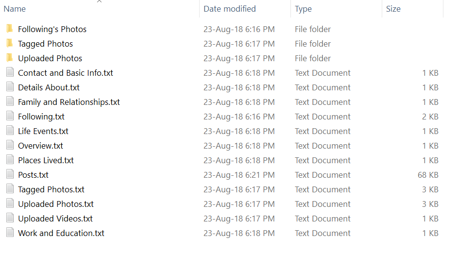
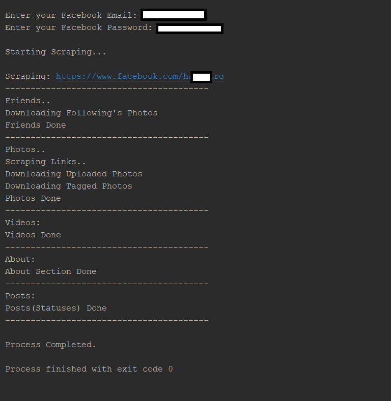

<a href="#">
  <div align="center">
    
  </div>
</a>

<h1 align="center">Ultimate Facebook Scraper (UFS)</h1>

<p align="center">
  Tooling that <b>automates</b> your social media interactions to collect posts, photos, videos, friends, followers and much more on Facebook.
</p>

<p align="center">
  <a href="https://www.codacy.com/manual/harismuneer/Ultimate-Facebook-Scraper?utm_source=github.com&amp;utm_medium=referral&amp;utm_content=harismuneer/Ultimate-Facebook-Scraper&amp;utm_campaign=Badge_Grade">
    
  </a>
  <a href="#">
    
  </a>
  <a href="#">
    
  </a>
  <a href="https://www.github.com/harismuneer/Ultimate-Facebook-Scraper/fork">
    
  </a>
  <a href="#">
    
  </a>
</p>

<hr>

<h2 align="center">Featured by Top Security Blogs and OSINT Researchers</h2>

<p align="center">
  <a href='https://books.google.com.pk/books?id=Yz7HDwAAQBAJ&pg=PT63&lpg=PT63&dq=ultimate+facebook+scraper&source=bl&ots=a1-xD2wHl_&sig=ACfU3U1znkOE0yamSMGFrP5MmnK1HCkVkw&hl=en&sa=X&ved=2ahUKEwiDy-2PiYjoAhUSA2MBHfmXCFMQ6AEwDnoECBQQAQ#v=onepage&q=ultimate%20facebook%20scraper&f=false'>
    
  </a>
  <br>


  <a href='https://securityonline.info/ultimate-facebook-scraper/'>
    
  </a>

  
  <a href='https://geeks3d.com/newz/item?id=28'>
    
  </a>

    
  <a href='https://en.kali.tools/all/?tool=2440'>
    
  </a>
      
  
  <a href='https://www.kitploit.com/2019/11/ultimate-facebook-scraper-bot-which.html'>
    
  </a>

  
  <a href='https://www.journaliststoolbox.org/2020/03/04/twitter_resources/'>
    
  </a>


  
  <a href='https://anonyviet.com/huong-dan-thu-thap-thong-tin-facebook-bang-ultimate-facebook-scraper/'>
    
  </a>


  
  <a href='https://blackarch.org/social.html'>
    
  </a>


  
  <a href='https://medium.com/week-in-osint/week-in-osint-48-59e992554489'>
    
  </a>

  
  <a href='https://hakin9.org/ultimate-facebook-scraper-ufs/'>
    
  </a>

  
  <a href='https://kalilinuxtutorials.com/ufs-ultimate-facebook-scraper/'>
    
  </a>

  
  <a href='https://onehack.us/t/ultimate-facebook-scraper-a-bot-which-scrapes-almost-everything-about-a-facebook/63803'>
    
  </a>
</p>

  
<hr>


## Features

A bot which scrapes almost everything about a user's Facebook profile including:

- uploaded photos
- tagged photos
- videos
- friends list and their profile photos (including Followers, Following, Work Friends, College Friends etc)
- and all public posts/statuses available on the user's timeline.

Data is scraped in an organized format to be used for educational/research purposes by researchers. This scraper does not use Facebook's Graph API meaning there are no rate limiting issues.

**This tool is being used by thousands of developers weekly and we are pretty amazed at this response! Thank you guys!🎉**

For **citing/referencing** this tool for your research, check the 'Citation' section below.

## Note

This tool uses xpaths of **'divs'** to extract data. Since Facebook updates its site frequently, the 'divs' get changed. Consequently, we have to update the divs accordingly to correctly scrape data.

The developers of this tool have devoted time and effort in developing, and maintaining this tool for a long time. **In order to keep this amazing tool alive, we need support from you geeks.**

The code is intuitive and easy to understand, so you can update the relevant xpaths in the code if you find data is not being scraped from profiles. Facebook has most likely updated their site, so please generate a pull request. Much appreciated!

## Sample

<p align="middle">
  
 </p>

## Screenshot

<p align="middle">
  
 </p>

---

## Usage

### Installation

You will need to:

- Install latest version of [Google Chrome](https://www.google.com/chrome/).
- Install [Python 3](https://www.python.org/downloads/)
- Have a Facebook account without 2FA enabled

```bash
$ git clone https://github.com/harismuneer/Ultimate-Facebook-Scraper.git
$ cd Ultimate-Facebook-Scraper

# Set up a virtual env
$ python3 -m venv venv
$ source venv/bin/activate

# Install Python requirements
$ pip install -e .
```

The code is multi-platform and is tested on both Windows and Linux.
The tool uses latest version of [Chrome Web Driver](http://chromedriver.chromium.org/downloads). I have placed the webdriver along with the code but if that version doesn't work then replace the chrome web driver with the latest one according to your platform and your Google Chrome version.

### How to Run

- Fill your Facebook credentials into [`credentials.yaml`](credentials.yaml)
- Edit the [`input.txt`](input.txt) file and add many profiles links as you want in the following format with each link on a new line:

Make sure the link only contains the username or id number at the end and not any other stuff. Make sure its in the format mentioned above.

> Note: There are two modes to download Friends Profile Pics and the user's Photos: Large Size and Small Size. You can change the following variables in [`scraper/scraper.py`](scraper/scraper.py#L30). By default they are set to Small Sized Pics because its really quick while Large Size Mode takes time depending on the number of pictures to download

```python
# whether to download the full image or its thumbnail (small size)
# if small size is True then it will be very quick else if its False then it will open each photo to download it
# and it will take much more time
friends_small_size = True
photos_small_size = True
```

Run the `ultimate-facebook-scraper` command ! 🚀

---

## Citation

<a href="https://zenodo.org/badge/latestdoi/145763277">
  
</a>

If you use this tool for your research, then kindly cite it. Click the above badge for more information regarding the complete citation for this tool and diffferent citation formats like IEEE, APA etc.

---

## Important Message

This tool is for research purposes only. Hence, the developers of this tool won't be responsible for any misuse of data collected using this tool. Used by many researchers and open source intelligence (OSINT) analysts.

This tool will not works if your account was set up with 2FA. You must disable it before using.

---

## Authors

You can get in touch with us on our LinkedIn Profiles:

#### Haris Muneer

[](https://www.linkedin.com/in/harismuneer)

You can also follow my GitHub Profile to stay updated about my latest projects: [](https://github.com/harismuneer)

#### Hassaan Elahi

[](https://www.linkedin.com/in/hassaan-elahi/)

You can also follow my GitHub Profile to stay updated about my latest projects: [](https://github.com/Hassaan-Elahi)

If you liked the repo then please support it by giving it a star ⭐!

## Contributions Welcome


If you find any bug in the code or have any improvements in mind then feel free to generate a pull request.

> Note: We use [Black](https://pypi.org/project/black/) to lint Python files. Please use it in order to have a valid pull request 😉

## Issues

[](https://www.github.com/harismuneer/Ultimate-Facebook-Scraper/issues)

If you face any issue, you can create a new issue in the Issues Tab and I will be glad to help you out.

## License

[](LICENSE)

Copyright (c) 2018-present, harismuneer, Hassaan-Elahi
